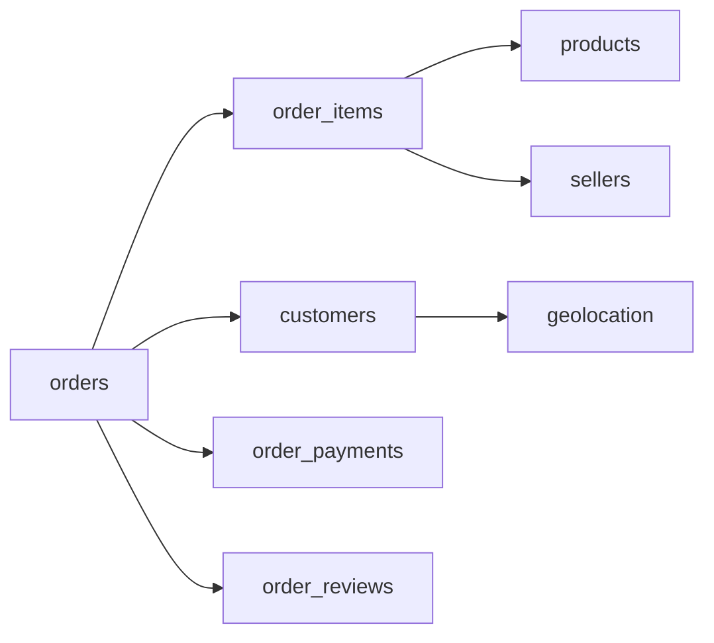

# Marketplace Incentives & Causal Inference — Project Plan

**Timeline:** 5 weeks (~35 hours)  
**Dataset:** [Olist Brazilian E-Commerce](https://www.kaggle.com/datasets/olistbr/brazilian-ecommerce) (~100K orders, 9 tables)  
**Scope:** Project 1 only. Event-level funnel work (Project 2) is a separate portfolio piece later.

---

## Goals

| Goal | What “done” looks like |
|------|-------------------------|
| **Learn** | You can explain identification, DiD, bootstrap CIs, and experiment design without notes |
| **Resume** | Public repo: SQL mart → quasi-experiment → DiD + CI → prospective A/B design doc |
| **Build habit** | You write the analysis; this plan gives questions, checks, and resources—not finished notebooks |

**Resume line (evolve as you ship weeks):**

> Marketplace Incentives & Causal Inference (In Progress) | Python, SQL, Statistics, Causal Inference  
> Building a multi-table SQL/Python analytics pipeline on marketplace logistics data and applying difference-in-differences with bootstrap confidence intervals to evaluate a simulated regional incentive rollout, quantifying effects on on-time delivery, customer satisfaction, and unit economics.

---

## Repo layout

```text
Marketplace-Incentives-Causal-Inference/
├── README.md                 # Portfolio entry (expand in Week 5)
├── PROJECT_PLAN.md           # This file
├── docs/
│   ├── ENVIRONMENT.md        # Tooling choices & how to run locally
│   ├── 04_experiment_design.md   # Week 4 (you write)
│   └── 05_decision_memo.md       # Week 5 (you write)
├── requirements.txt
├── .gitignore
├── data/
│   ├── raw/olist/            # Kaggle CSVs (not committed)
│   └── olist.db              # DuckDB (not committed)
├── notebooks/
│   ├── 01_data_ingestion.ipynb
│   ├── 02_treatment_definition.ipynb
│   └── 03_diff_in_diff_analysis.ipynb
├── sql/                      # Reusable queries (optional but strong signal)
└── scripts/                  # e.g. power_analysis.py (Week 4)
```

---

## Tech stack

| Component | Tool | Role in this project |
|-----------|------|----------------------|
| Ingestion | Python + pandas | CSV inspection, optional loads |
| Database | **DuckDB** | Joins, window functions, single-file `olist.db` |
| Analysis | pandas, scipy, statsmodels | DiD, bootstrap, logistic regression (stretch) |
| Viz | Matplotlib, Seaborn, Plotly | EDA, parallel trends, funnels later |
| Notebooks | Jupyter | Narrative + reproducible steps |
| Version control | Git + GitHub | Portfolio hosting |

---

## Progress tracker

| Week | Focus | Status | Deliverable |
|------|--------|--------|-------------|
| **0** | Environment + data download | Setup in repo; **you** download Kaggle data | `requirements.txt`, venv, 9 CSVs in `data/raw/olist/` |
| **1** | Ingestion + EDA | Pending | `01_data_ingestion.ipynb`, `data/olist.db`, `orders_analytical` |
| **2** | Treatment + DAG | Pending | `02_treatment_definition.ipynb`, balance table |
| **3** | DiD + inference | Pending | `03_diff_in_diff_analysis.ipynb`, parallel trends, bootstrap CI |
| **4** | Experiment design | Pending | `docs/04_experiment_design.md`, power script |
| **5** | Polish | Pending | README, `05_decision_memo.md`, GitHub, resume bullets |

---

## Week 0: Environment & data (~2 hrs)

**You do (after repo setup):**

1. Activate venv — see [docs/ENVIRONMENT.md](docs/ENVIRONMENT.md)
2. Download Olist into `data/raw/olist/` ([Kaggle](https://www.kaggle.com/datasets/olistbr/brazilian-ecommerce) or CLI)
3. Confirm **9 CSV files** and skim row counts (no full pipeline yet)

**Done when:** `import duckdb, pandas, statsmodels` works and you can list 9 files under `data/raw/olist/`.

---

## Week 1: Setup + EDA (~7 hrs)

**Deliverables:** `notebooks/01_data_ingestion.ipynb`, `data/olist.db`

### Phase 1 — Load all tables

- Document **primary key** and grain per table
- Check dtypes, nulls, duplicate keys
- Load all 9 tables into DuckDB (one consistent pattern: `read_csv_auto` or pandas → `CREATE TABLE`)

**Acceptance:** `information_schema` lists 9 tables; ~100K orders.

### Phase 2 — Order-level analytical mart

**Grain:** one row per `order_id`.

Join path (conceptual):



- Aggregate `order_items` before joining to avoid fan-out
- Materialize: `CREATE TABLE orders_analytical AS ...`

**Acceptance:** `COUNT(*) = COUNT(DISTINCT order_id)` on `orders_analytical`.

### Phase 3 — EDA (outcome-focused)

Define in markdown **before** plotting:

| Metric | You must define |
|--------|-----------------|
| Delivery days | e.g. delivered − purchase (handle not delivered) |
| On-time | Olist has no SLA—pick a rule and document it |
| Region | customer state or zip → geolocation bucket |

**Plots:** delivery days histogram; on-time by state; orders over time (monthly).

**Resume hook:** “Built 9-table DuckDB pipeline and order-level analytical mart with SQL joins.”

---

## Week 2: Causal framing + treatment (~7 hrs)

**Deliverable:** `notebooks/02_treatment_definition.ipynb` + summary table

**Read first:** Brady Neal Lectures 3–4 (DAGs, backdoor) — [course](https://www.bradyneal.com/causal-inference-course)

### Write down

1. **Treatment:** simulated surge/incentive in 3 high-volume regions after `2017-06-01` (not a real A/B test)
2. **Outcome:** on-time rate (primary); delivery days, revenue/order (secondary)
3. **Estimand:** DiD effect of regional “policy” on logistics outcomes
4. **DAG:** region, density, seasonality, volume → treatment → delivery performance

### Treatment indicator

```text
treated = 1  IF customer_state IN (SP, RJ, ?) AND order_date >= '2017-06-01'
         = 0  otherwise (pre-period: both arms for DiD setup)
```

**Acceptance:** Table with `period`, `group`, `n_orders`, `on_time_rate`, `avg_delivery_days` (pre vs post, treatment vs control).

**Resume honesty:** Say “simulated regional rollout” or “quasi-experimental DiD”—not “we ran an experiment.”

---

## Week 3: DiD + inference (~8 hrs)

**Deliverable:** `notebooks/03_diff_in_diff_analysis.ipynb`

**Read first:**

- [Python DiD chapter](https://matheusfacure.github.io/python-causality-handbook/13-Difference-in-Differences.html)
- [scipy.stats.bootstrap](https://docs.scipy.org/doc/scipy/reference/generated/scipy.stats.bootstrap.html)

| Step | Task |
|------|------|
| 1 | 2×2 DiD table by hand; DiD = (T_post − T_pre) − (C_post − C_pre) |
| 2 | **Parallel trends** — weekly on-time, pre-cutoff only, two lines |
| 3 | Bootstrap 95% CI (10k resamples); document resampling unit (orders vs clusters) |
| 4 | Sensitivity: cutoff ±7 days |
| 5 | (Stretch) ATT in words vs ATE |

**Acceptance:** Summary table + parallel trends figure + sensitivity table.

---

## Week 4: Prospective experiment design (~6 hrs)

**Deliverable:** `docs/04_experiment_design.md` + `scripts/power_analysis.py` (or notebook section)

Pitch a **real** randomized rollout after the quasi-experiment. Sections:

1. Hypothesis (+5 pp on-time in high-demand zones)
2. Unit of randomization (zone-weeks; why not driver-level?)
3. North star + guardrails
4. Sample size — `statsmodels.stats.power.zt_ind_solve_power` with stated baseline, MDE, α, power
5. Failure modes: novelty, spillover, gaming
6. Runtime / feasibility vs Olist volume

---

## Week 5: Portfolio polish (~7 hrs)

**Deliverables:** README, `docs/05_decision_memo.md`, clean GitHub push

**README sections:** problem → data → approach → **finding + CI** → limitations → reproduce → link to experiment doc

**Decision memo:** Context → Evidence → Recommendation → Risks → Ask

**Three resume bullets:** pipeline | inference | experimentation — plus 90-second verbal story.

---

## Learning resources

### Causal inference

- Brady Neal — [course](https://www.bradyneal.com/causal-inference-course) / [YouTube](https://www.youtube.com/playlist?list=PLoazKTcS0Rzb6bb9L508cyJ1z-U9iWkA0) (L1–6 for this project)
- DiD: [Python causality handbook Ch. 13](https://matheusfacure.github.io/python-causality-handbook/13-Difference-in-Differences.html)

### Bootstrap & power

- [SciPy bootstrap](https://docs.scipy.org/doc/scipy/reference/generated/scipy.stats.bootstrap.html)
- [Power analysis (Python)](https://statsthinking21.github.io/statsthinking21-python/09-StatisticalPower.html)

### Later (Project 2)

- Funnel / sessionization: [Hex funnel guide](https://hex.tech/blog/funnel-analysis/), [Omni sessionization](https://omni.co/blog/getting-started-with-sessionization)

---

## Olist gotchas

- **Not delivered:** filter or segment by `order_status`
- **Geolocation:** multiple rows per zip — aggregate before join
- **Multi-item / multi-seller orders:** aggregate to order grain before DiD
- **Reviews:** missingness for satisfaction as secondary outcome
- **Timestamps:** naive; stay consistent

---

## Resume signal checklist (end state)

| Signal | Evidence |
|--------|----------|
| SQL | 9-table joins, analytical mart, optional window functions |
| Python | pandas, scipy bootstrap, statsmodels |
| Causal | DAG, DiD, parallel trends, sensitivity |
| Experimentation | power analysis + design doc |
| Communication | README + decision memo |

---

## Your next action

1. Read [docs/ENVIRONMENT.md](docs/ENVIRONMENT.md) and activate `.venv`
2. Download Olist CSVs to `data/raw/olist/`
3. Create `notebooks/01_data_ingestion.ipynb` — load **only** `orders`, print schema and date range
4. Share row count + min/max dates when ready for join design help
