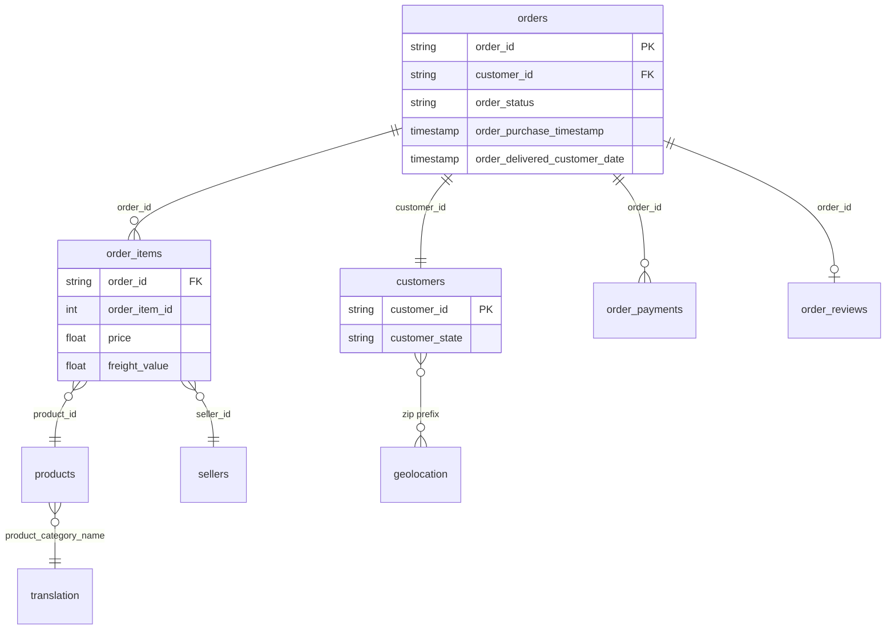

# Marketplace Incentives & Causal Inference

Quasi-experimental analysis on [Olist Brazilian E-Commerce](https://www.kaggle.com/datasets/olistbr/brazilian-ecommerce) data: multi-table SQL pipeline, simulated regional incentive rollout, difference-in-differences with bootstrap confidence intervals, and a prospective experiment design.

**Status:** In progress — Week 1 (data ingestion & quality audit)

---

## Background & overview

**Business question:** Would regional surge bonuses for logistics partners improve **on-time delivery** in high-volume Brazilian states?

**Approach:** Olist has no real A/B test for this policy. We simulate a regional rollout (treated states × post-cutoff date) and estimate the effect with **difference-in-differences**, bootstrap confidence intervals, and parallel-trends checks. Week 4 adds a prospective randomized experiment design.

**Why this matters:** Marketplace ops teams often roll out incentives regionally before running formal experiments. This project shows how to (1) build a trustworthy order-level mart, (2) frame a causal question honestly, and (3) quantify uncertainty—not just point estimates.

| Doc | Description |
|-----|-------------|
| [MASTERPLAN.md](MASTERPLAN.md) | Canonical plan (definitions of done + acceptance checks) |
| [PROJECT_PLAN.md](PROJECT_PLAN.md) | 5-week roadmap + learning resources |
| [docs/DATA_MODEL.md](docs/DATA_MODEL.md) | Table grains, keys, join rules, ERD |
| [docs/ENVIRONMENT.md](docs/ENVIRONMENT.md) | Local setup, Kaggle download |

---

## Data structure overview

Nine raw CSVs (~100K orders). Target analytical grain: **one row per `order_id`** in `orders_analytical`.



**Join rule for the mart:** aggregate `order_items` and `order_payments` to order level *before* joining to `orders`. See [docs/DATA_MODEL.md](docs/DATA_MODEL.md) for full schema.

---

## Executive summary

*Updated as analysis progresses. Final numbers after Week 3.*

| Item | Current state |
|------|----------------|
| **Data** | 99,441 orders (Sep 2016 – Oct 2018); 9 raw tables loaded in [`01_data_ingestion.ipynb`](notebooks/01_data_ingestion.ipynb) |
| **Quality** | Delivery timestamps null for non-delivered orders (expected); 8 delivered exceptions (~0.01%) |
| **Mart** | `orders_analytical` — not built yet |
| **Treatment** | Simulated regional rollout — Week 2 |
| **Causal estimate** | DiD + bootstrap CI — Week 3 |
| **Recommendation** | Decision memo — Week 5 |

---

## Insights deep dive

*Placeholder — populated after EDA (Week 1) and DiD (Week 3).*

Planned sections:

- Outcome distributions (`delivery_days`, on-time rate by state and month)
- Pre-period balance (treated vs control states)
- Parallel trends and DiD estimate with 95% CI
- Sensitivity to cutoff date

---

## Recommendation

*Placeholder — Week 5 decision memo (`docs/05_decision_memo.md`).*

Will summarize: evidence for/against expanding regional incentives, key risks (parallel trends, spillover), and ask for a prospective A/B test.

---

## Reproduce locally

```bash
source .venv/bin/activate
pip install -r requirements.txt   # if you recreate the venv
```

Download dataset CSVs to `data/raw/olist/` ([instructions](docs/ENVIRONMENT.md)), then run [`notebooks/01_data_ingestion.ipynb`](notebooks/01_data_ingestion.ipynb).

**Tech stack:** Python · DuckDB · pandas · scipy · statsmodels · Jupyter · Matplotlib / Seaborn

---

## Resume (in progress)

Building a multi-table SQL/Python analytics pipeline on marketplace logistics data and applying difference-in-differences with bootstrap confidence intervals to evaluate a simulated regional incentive rollout, quantifying effects on on-time delivery, customer satisfaction, and unit economics.
