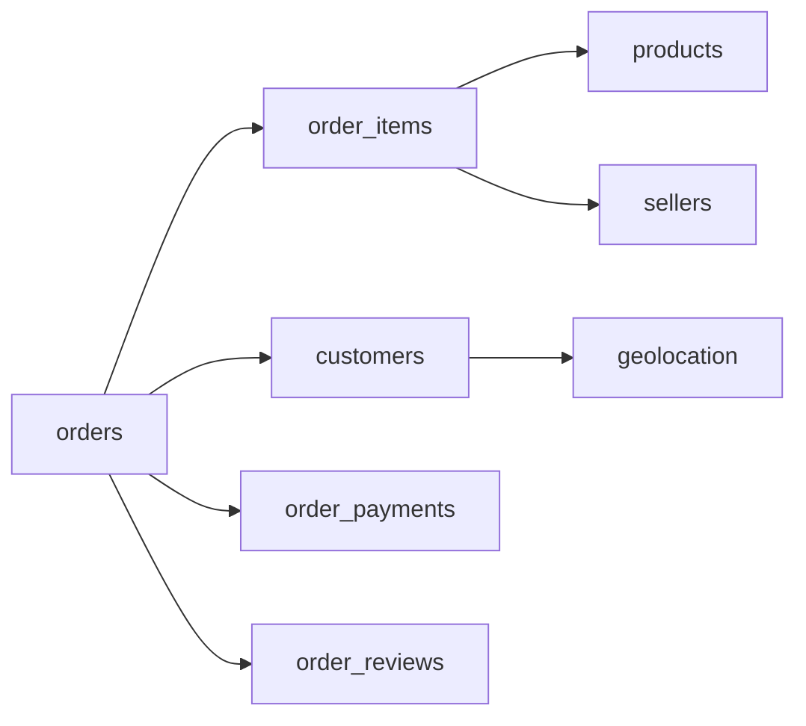

# Marketplace Incentives: Your Guided Build Plan

> **Canonical plan:** See [PROJECT_PLAN.md](PROJECT_PLAN.md) for the polished repo roadmap. This file retains Cursor-specific todos and mentoring detail.

## Where you are now

- Repo: scaffolding + [PROJECT_PLAN.md](PROJECT_PLAN.md) + [docs/ENVIRONMENT.md](docs/ENVIRONMENT.md). You still download Kaggle data and build notebooks.
- Resume line is already strong; the project makes it credible when the repo shows **SQL joins → analytical grain → causal framing → DiD + bootstrap → experiment design doc**.
- Scope: **Project 1 (Olist) only** for 5 weeks. Project 2 (events/funnel) is a separate portfolio piece later.

## How we work together

You write the code. I do **not** hand you full notebooks. Each week I give you:

1. **Driving questions** (what to decide and build).
2. **Acceptance checks** (how you know you’re done).
3. **Concept pointers** (which lecture/tutorial to read *before* coding that piece).

When stuck, paste: **goal, what you tried, error/output, 10–20 lines of code**. I’ll explain the concept and nudge—not rewrite the notebook.

Suggested repo layout (you create as you go):

```text
Marketplace-Incentives-Causal-Inference/
├── README.md
├── requirements.txt
├── .gitignore          # data/, *.db, .ipynb_checkpoints/
├── data/
│   ├── raw/            # Kaggle CSVs (not committed)
│   └── olist.db        # DuckDB (not committed)
├── notebooks/
│   ├── 01_data_ingestion.ipynb
│   ├── 02_treatment_definition.ipynb
│   └── 03_diff_in_diff_analysis.ipynb
├── docs/
│   ├── 04_experiment_design.md
│   └── 05_decision_memo.md
└── scripts/            # optional: power_analysis.py
```

---

## Week 0 (before Week 1): Environment — ~2 hrs

Answer these yourself:


| Question                                                                 | Why it matters                                      |
| ------------------------------------------------------------------------ | --------------------------------------------------- |
| Do I have Kaggle API credentials and `kaggle datasets download` working? | Blocks all downstream work                          |
| venv or conda? Python 3.10+?                                             | Reproducibility for reviewers                       |
| DuckDB or SQLite? (Plan assumes **DuckDB**.)                             | Window functions, fast analytics, single `.db` file |


**You do:**

- Create venv, `pip install pandas duckdb jupyter matplotlib seaborn scipy statsmodels plotly`
- Add `requirements.txt` and `.gitignore` for `data/`, `*.db`, checkpoints
- Download [Brazilian E-Commerce](https://www.kaggle.com/datasets/olistbr/brazilian-ecommerce) into `data/raw/`
- Skim all 9 CSV filenames and row counts—no coding yet

**Come back when:** `import duckdb; import pandas` works and you can list 9 files in `data/raw/`.

---

## Week 1: Setup + EDA — 7 hrs

**Deliverable:** `notebooks/01_data_ingestion.ipynb` + `data/olist.db`

### Phase 1 — Load (questions to answer in code)

1. What is the **primary key** of each table? (orders: `order_id`, items: `order_id` + `order_item_id`, etc.)
2. For each CSV, what are **dtypes**, **null rates**, and **duplicate keys**?
3. How will you load into DuckDB: `read_csv_auto`, `pandas.to_sql`, or `COPY`? Pick one pattern and use it for all 9 tables.

**Acceptance:** `SELECT table_name FROM information_schema.tables` returns 9 names; row counts match Kaggle docs (~100k orders).

### Phase 2 — Master grain (the core SQL skill)

**Driving question:** *What is one row in my analytical table?*

Answer: **one row per order** (not per item). You must decide:

- How to aggregate `order_items` (sum `price`, count items, list sellers?)
- How to attach **one customer location** (customer → zip → geolocation)
- Which timestamp defines “order date” (`order_purchase_timestamp` vs `order_approved_at`)

**Join path to implement (conceptually):**




Write the JOIN in **SQL inside DuckDB first** (notebook cell: `duckdb.sql(...)`), then materialize:

`CREATE TABLE orders_analytical AS ...`

**Acceptance:** Grain check — `COUNT(*) = COUNT(DISTINCT order_id)` on `orders_analytical`.

### Phase 3 — EDA metrics (define before plotting)


| Metric        | Definition you must write down                                                                                                          |
| ------------- | --------------------------------------------------------------------------------------------------------------------------------------- |
| Delivery days | `delivered_to_customer - purchase` (handle nulls / not delivered)                                                                       |
| On-time       | Olist has no SLA in raw data—you **define** a rule (e.g. delivered within 20 days, or within p90 of category). Document it in markdown. |
| Region        | Map `customer_zip_code_prefix` → lat/lng → state or custom “high-demand” bucket                                                         |


**Plots to build yourself:**

- Histogram of delivery days
- On-time rate by state/region (bar or map)
- Optional: seller concentration by region

**Learning (do before Phase 3):** SQL JOIN types; read 30 min on geolocation duplication (many rows per zip—aggregate or `DISTINCT ON`).

**Resume hook this week:** “Built 9-table DuckDB pipeline and order-level analytical mart with SQL joins.”

---

## Week 2: Causal framing + treatment — 7 hrs

**Deliverable:** `notebooks/02_treatment_definition.ipynb` + summary table

**Watch first (4.5 hrs):** Brady Neal Lectures 3–4 (DAGs, backdoor).

### Questions you must answer in writing (markdown cells)

1. **What is the “treatment”?**
  Simulated surge/incentive in 3 regions after `2017-06-01`. This is **not** a real A/B test—it's a **policy-style quasi-experiment** you design.
2. **What is the outcome?**
  Primary: on-time rate. Secondary: avg delivery days, revenue per order (from items).
3. **What is the estimand?**
  DiD on regional adoption → effect on logistics outcomes (later: ATT).
4. **Draw a DAG** (pen and paper or Mermaid):
  Nodes: region, urban density, seller density, seasonality, order volume, treatment, delivery performance.  
   Which paths are backdoor confounders?

### Treatment column

Define explicitly:

```text
treated = 1 IF customer_state IN (SP, RJ, ?) AND order_date >= '2017-06-01'
          0 IF customer_state NOT IN (...) AND order_date >= cutoff
          (pre-period: both groups, treated=0 for DiD setup)
```

**Questions:**

- Why 3 regions? Show **baseline order volume** table before choosing.
- Is cutoff `2017-06-01` arbitrary? Note that—you’ll sensitivity-test in Week 3.
- Pre-treatment balance: compare on-time rate and delivery days **before cutoff**, treatment vs control regions.

**Acceptance:** Table with columns `period` (pre/post), `group` (treatment/control), `n_orders`, `on_time_rate`, `avg_delivery_days`.

**Resume honesty:** Say “simulated regional incentive rollout” or “quasi-experimental DiD”—not “ran an experiment.”

---

## Week 3: DiD + inference — 8 hrs

**Deliverable:** `notebooks/03_diff_in_diff_analysis.ipynb`

**Read first (2.5 hrs):** [Python DiD chapter](https://matheusfacure.github.io/python-causality-handbook/13-Difference-in-Differences.html) + [scipy.stats.bootstrap](https://docs.scipy.org/doc/scipy/reference/generated/scipy.stats.bootstrap.html)

### Step 1 — 2x2 DiD by hand

Build a 2×2 table (means only):


|                  | Pre | Post |
| ---------------- | --- | ---- |
| Treatment region |     |      |
| Control region   |     |      |


**DiD** = (T_post − T_pre) − (C_post − C_pre)

Do it in SQL or pandas—**both** is good practice. Numbers must match.

### Step 2 — Parallel trends (most important plot)

**Question:** In the **pre** period only, do treatment and control regions have similar **slopes** in on-time rate over calendar time (week or month)?

- Plot weekly on-time rate, two lines, **stop at cutoff**
- If lines diverge before treatment, your design is weak—document that (shows statistical maturity)

### Step 3 — Bootstrap CI

**Questions:**

- What is the **unit of resample**? (Orders? Weeks? Regions?)  
Start with **orders** (simple); note in markdown that **cluster bootstrap by region** is more conservative—optional stretch goal.
- Statistic to bootstrap: your DiD estimator function.
- Report point estimate + 95% CI + interpret (“we cannot reject zero” vs “positive effect of X pp”).

### Step 4 — Sensitivity

Re-run DiD with cutoff ±7 days. Table: cutoff date, DiD estimate, CI width.

### Step 5 — ATT (stretch)

Facure chapter: ATT vs ATE. In words: effect on **treated region orders post-policy**, not national average.

**Acceptance:** One summary table + parallel trends figure + sensitivity table.

**Resume hook:** “Difference-in-differences with bootstrap CIs; parallel trends and cutoff sensitivity.”

---

## Week 4: Experiment design (prospective) — 6 hrs

**Deliverable:** [docs/04_experiment_design.md](docs/04_experiment_design.md) + small power script

This week is **writing**, not more causal coding on Olist. You pretend you’re pitching a **real** randomized rollout after the quasi-experiment suggested an effect.

### Doc sections (answer as PM-facing prose)

1. **Hypothesis** — surge bonuses → +5 pp on-time in high-demand zones
2. **Unit of randomization** — zone-weeks (why not driver-level?)
3. **Metrics** — north star + guardrails (earnings/hr, margin—use proxies from Olist if needed, labeled as illustrative)
4. **Sample size** — `statsmodels.stats.power.zt_ind_solve_power`
  - **You must define:** baseline rate, MDE (5 pp), alpha, power, then convert effect size (Cohen’s h or proportion difference → `effect_size`)
5. **Failure modes** — novelty, spillover, gaming
6. **Runtime** — how many weeks to run given weekly order volume per zone

**Power analysis questions:**

- What baseline on-time rate did you observe in control regions?
- Is MDE 5 percentage points realistic vs your DiD point estimate?
- What `n` does the formula return—and is that feasible in 8 weeks of Olist-scale volume?

**Acceptance:** ~2 pages, one numbered equation or code block for power, explicit assumptions list.

---

## Week 5: Portfolio polish — 7 hrs

**Deliverables:** README, [docs/05_decision_memo.md](docs/05_decision_memo.md), GitHub push

### README structure (non-technical lead + technical appendix)

1. Problem (marketplace on-time delivery in peak regions)
2. Data (Olist, link, N orders)
3. Approach (simulated incentive, DiD, bootstrap)
4. **Key finding** (one sentence + CI)
5. Limitation (observational; parallel trends assumption)
6. Next step (randomized experiment — link to doc 04)
7. How to reproduce (`pip install`, download data, run notebooks 01→03)

### Decision memo (`05_decision_memo.md`)

Template: Context → Evidence (DiD table) → Recommendation (ship / don’t ship / run A/B) → Risks → Ask (headcount, timeline).

### Resume bullets (evolve from “In Progress”)

Draft 3 bullets yourself, then we refine:

- **Pipeline:** multi-table SQL/DuckDB mart  
- **Inference:** DiD + bootstrap CI + parallel trends  
- **Product:** experiment design + power analysis

Practice **90-second story:** problem → quasi-experiment → assumption → result → what you’d do next.

**Acceptance:** Public repo with clean README, no secrets, no multi-GB files committed.

---

## Resume signal checklist (end of 5 weeks)


| Signal           | Evidence in repo                                         |
| ---------------- | -------------------------------------------------------- |
| SQL at scale     | 9-table joins, window functions if you add cohort trends |
| Python analytics | pandas + statsmodels/scipy                               |
| Causal thinking  | DAG, DiD, parallel trends, sensitivity                   |
| Experimentation  | power analysis + design doc                              |
| Communication    | README + decision memo                                   |


---

## Olist gotchas (look these up when you hit them)

- **Delivered nulls:** `order_status` not delivered → exclude or separate analysis  
- **Geolocation duplicates:** multiple lat/lng per zip—aggregate before join  
- **Multiple sellers per order:** aggregate at order level before DiD  
- **Reviews optional:** satisfaction as secondary outcome, expect missingness  
- **Time zone:** timestamps are naive; be consistent

---

## Suggested weekly rhythm


| Day | Activity                                |
| --- | --------------------------------------- |
| 1–2 | Read + driving questions on paper       |
| 3–5 | Code + SQL                              |
| 6   | Plots + markdown interpretation         |
| 7   | Acceptance checks; paste blockers to me |


---

## Your immediate next steps (this weekend)

1. Week 0: venv, Kaggle download, `.gitignore`, `requirements.txt`
2. Open blank `01_data_ingestion.ipynb`
3. Load **one** table into DuckDB and print schema—stop there
4. Message me with: table name, row count, and your chosen **analytical grain** sentence

From there we’ll go week-by-week in Socratic mode.